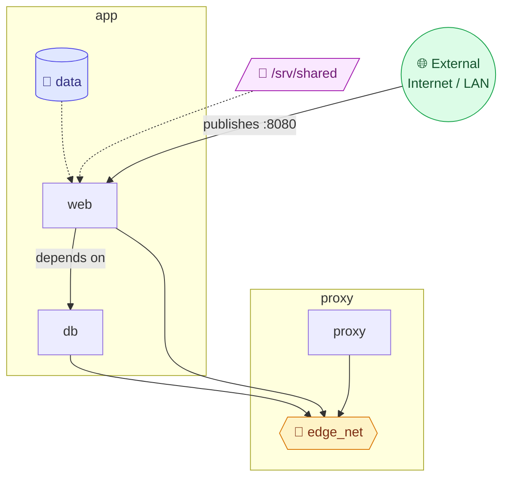
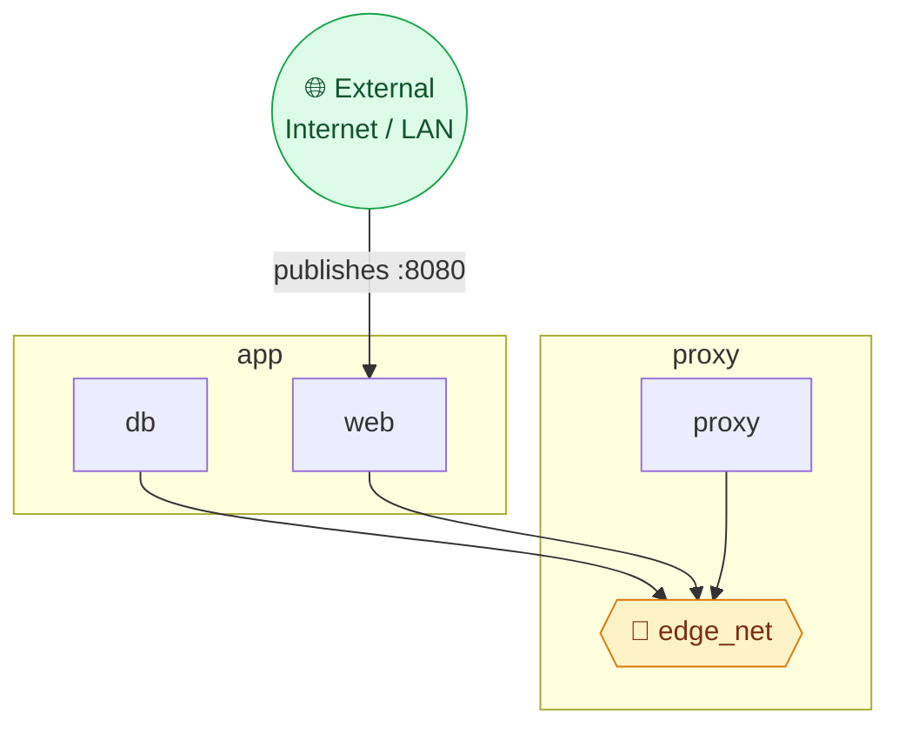
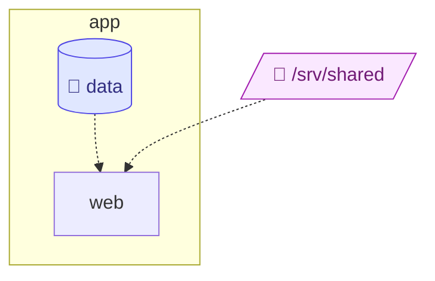
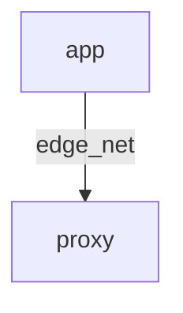

# Docker Compose dependency map

## Map

<!-- compose-map:map:start -->

<!-- compose-map:map:end -->

## Network / ports

<!-- compose-map:network:start -->

<!-- compose-map:network:end -->

## Volumes / mounts

<!-- compose-map:volumes:start -->

<!-- compose-map:volumes:end -->

## Compose dependencies

<!-- compose-map:dependencies:start -->

<!-- compose-map:dependencies:end -->
